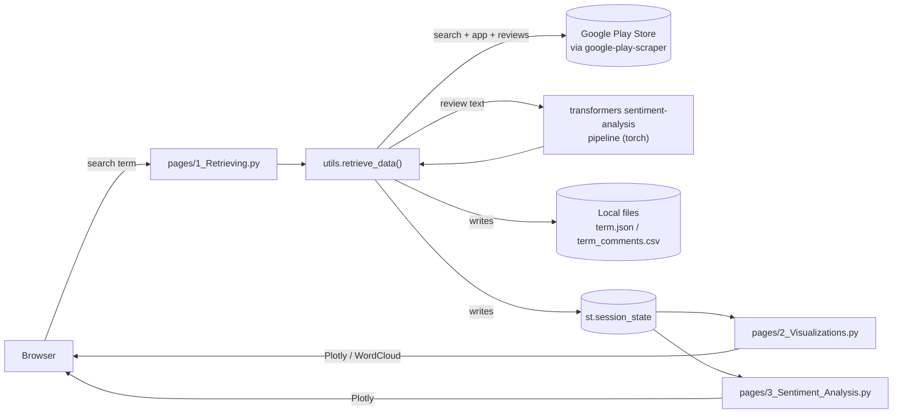

# Auto App Reviewer Platform

this is a Streamlit app that searches the Google Play Store for a keyword, pulls competing apps and their reviews, runs each review through a local sentiment-analysis model, and renders the result as an interactive market-analysis dashboard.


<!-- TODO: add demo GIF here — capture: (1) typing a search term like "note taking ai" on the Retrieving page, (2) the resulting data table + sentiment table appearing, (3) a quick tab-through of the Visualizations page (bar chart, word cloud) and the Sentiment Analysis pie/bar charts. -->

## Table of contents

- [Overview](#overview)
- [Architecture](#architecture)
- [Tech stack](#tech-stack)
- [Getting started](#getting-started)
- [Usage](#usage)
- [Project structure](#project-structure)
- [Known limitations](#known-limitations)
- [Roadmap](#roadmap)
- [License](#license)

## Overview

Comparing competing mobile apps normally means manually opening each Play Store listing and reading through reviews. This app takes one search term, retrieves the top 20 matching apps and their 20 newest reviews each, and turns that into ratings/downloads comparisons, category and genre trends, a description word cloud, and a per-app sentiment breakdown.

The core design decision is that sentiment analysis runs locally: each review is passed through a Hugging Face `transformers` sentiment-analysis pipeline (`torch` backend) inside the same process serving the UI, instead of calling a hosted NLP API. That keeps the app dependency-free of any external ML service, at the cost of loading a real model into memory on the Streamlit server ([utils.py](utils.py)).

**Features** (each maps to real code, not aspirational):
- **Keyword search across the Play Store** — `search()` + `app()` from `google-play-scraper` fetch up to 20 matching apps and their metadata ([utils.py](utils.py) `retrieve_data`)
- **Per-review sentiment scoring** — every one of the 20 newest reviews per app is classified POSITIVE/NEGATIVE with a confidence score via `transformers.pipeline("sentiment-analysis")` ([utils.py](utils.py))
- **Market overview table** — ratings, downloads, price, developer, genre, category, average sentiment score, and positive/negative percentage per app ([pages/2_Visualizations.py](pages/2_Visualizations.py))
- **Interactive filtering** — sidebar filters by category, genre, app, and minimum rating, applied to both the app table and the review table ([pages/2_Visualizations.py](pages/2_Visualizations.py), [pages/3_Sentiment_Analysis.py](pages/3_Sentiment_Analysis.py))
- **Visualizations** — Plotly bar/scatter/area charts for ratings and release/genre trends, a Matplotlib/WordCloud description cloud, and a single-app drill-down tab
- **Sentiment dashboard** — a Plotly pie chart of sentiment distribution and a bar chart of average confidence per app
- **Local persistence** — every search writes `{term}.json`, `{term}.csv`, `{term}_comments.json`, `{term}_comments.csv` to the working directory, in addition to populating `st.session_state` for the current session ([utils.py](utils.py))

## Architecture



This is a single Streamlit process — there is no separate backend service, database, queue, or cache. `st.session_state` is the only in-memory hand-off between the three pages within one browser session; the JSON/CSV files on disk are a secondary, durable copy of the same data written on every search.

**Flow:** user enters a term on the Retrieving page → `retrieve_data()` searches Play Store apps, fetches each app's details and 20 newest reviews, scores every review's sentiment, aggregates per-app stats, and stores the result in both `st.session_state` and local files → the Visualizations and Sentiment Analysis pages read `st.session_state` and render charts; if it's empty (no search run yet) they stop and prompt the user back to Retrieving.

## Tech stack

| Layer | Technology |
|---|---|
| App framework | Streamlit (multipage app: `Home.py` + `pages/`) |
| Data source | `google-play-scraper` — unofficial Google Play Store scraping library |
| NLP | `transformers` + `torch` — `pipeline("sentiment-analysis")` <!-- TODO: confirm which default model your installed transformers version resolves this to (commonly distilbert-base-uncased-finetuned-sst-2-english); none is pinned explicitly in code --> |
| Data handling | `pandas`, `numpy` |
| Visualization | `plotly` (Express), `matplotlib`, `wordcloud` |
| Dev environment | VS Code Dev Container / GitHub Codespaces, Python 3.11 image ([.devcontainer/devcontainer.json](.devcontainer/devcontainer.json)) |

No package versions are pinned in [requirements.txt](requirements.txt) — it lists bare package names only. <!-- TODO: pin versions (e.g. via `pip freeze`) for reproducible installs -->

No Docker Compose, Makefile, database, or CI workflow is present in this repo.

## Getting started

### Prerequisites

- Python 3.11 (matches the Dev Container image; not enforced by `requirements.txt`) <!-- TODO: confirm minimum supported Python version -->
- `pip`

### Installation

```bash
git clone <repo-url>
cd Auto_app_reviewer-platform
python -m venv venv
source venv/bin/activate   # Windows: venv\Scripts\activate
pip install -r requirements.txt
```

The first run will download the default `transformers` sentiment-analysis model — this requires an internet connection and takes a moment.

### Environment setup

No `.env` or `.env.example` file exists and the code reads no environment variables — nothing to configure.

### Running it

```bash
streamlit run Home.py
```

Opens at `http://localhost:8501`.

### Quickest path (Dev Container / Codespaces)

The repo ships a working Dev Container ([.devcontainer/devcontainer.json](.devcontainer/devcontainer.json)) that installs `requirements.txt` and auto-starts the app on attach:

```json
"postAttachCommand": {
  "server": "streamlit run Home.py --server.enableCORS false --server.enableXsrfProtection false"
}
```

Opening this repo in a GitHub Codespace or VS Code Dev Container installs dependencies and launches the app on port `8501` with no manual steps.

## Usage

1. Open the app and go to the **Retrieving** page.
2. Enter a search term — the app itself suggests examples ([pages/1_Retrieving.py](pages/1_Retrieving.py)):
   - `note taking ai`
   - `productivity`
   - `language learning`
   - `meditation`
   - `fitness tracker`
3. Press Enter. The app searches the top 20 matching apps, pulls their 20 newest reviews each, and scores sentiment — this can take a while since inference runs synchronously per review.
4. It writes local files and populates the session, e.g. for the term `meditation`:
   - `meditation.json`, `meditation.csv` — one row per app (rating, downloads, genre, sentiment %, ...)
   - `meditation_comments.json`, `meditation_comments.csv` — one row per review (text, sentiment label, confidence)
5. Go to **Visualizations** for market-overview charts, or **Sentiment Analysis** for the sentiment pie/bar charts. Both read the same `st.session_state` data populated in step 3.

Illustrative row from the per-app output (`utils.py` `retrieve_data`, field names verified, values are examples):

```json
{
  "title": "Example Meditation App",
  "downloads": 5000000,
  "overall rating": 4.6,
  "released": "2019-03-12T00:00:00",
  "genre": "Health & Fitness",
  "categories": "Health & Fitness",
  "price": 0,
  "developer": "Example Dev Inc.",
  "average score": 0.92,
  "positive_percentage": 85.0,
  "negative_percentage": 15.0
}
```

## Project structure

```
Auto_app_reviewer-platform/
├── .devcontainer/
│   └── devcontainer.json        # Codespaces/Dev Container: Python 3.11, auto-installs deps, runs Streamlit on :8501
├── Home.py                      # Landing page — project description, features, usage guide
├── pages/
│   ├── 1_Retrieving.py          # Search input → triggers utils.retrieve_data(), shows the raw results
│   ├── 2_Visualizations.py      # Market overview, trends, word cloud, per-app drilldown
│   └── 3_Sentiment_Analysis.py  # Sentiment distribution pie chart + per-app confidence bar chart
├── utils.py                     # Core logic: Play Store scraping, sentiment pipeline, JSON/CSV persistence
├── test.py                      # Standalone scratch script for a sentiment model — uses `pysentimiento`,
│                                 # which is not in requirements.txt; not imported by the app
└── requirements.txt             # streamlit, pandas, plotly, wordcloud, matplotlib, numpy, transformers, torch, google-play-scraper
```

## Known limitations

- **No result caching** — re-submitting the same search term re-scrapes the Play Store and re-runs sentiment inference from scratch; there's no memoization keyed on the search term.
- **Shared disk state across sessions** — `st.session_state` is per-browser-session, but the `{term}.json`/`.csv` files `retrieve_data()` writes are shared on disk. Two users searching the same term concurrently on one deployed instance will overwrite each other's files.
- **Unsanitized filenames** — the search term is used directly as a filename (`f"{item}.json"`); terms containing path separators or other special characters are not handled.
- **Synchronous, per-review inference** — sentiment scoring for up to 400 reviews (20 apps × 20 reviews) happens sequentially in the request path, so a single search can be slow.

## Roadmap

From [Home.py](Home.py)'s own "Future Improvements" section:
- Add data from other sources (App Store, ProductHunt, GitHub)
- Competitor benchmarking features
- User persona analysis based on reviews
- Time-series analysis for app rating changes

<!-- TODO: Home.py also lists "Implement sentiment analysis on app reviews" as a future improvement, but this is already implemented in utils.py and pages/3_Sentiment_Analysis.py — that line in Home.py looks stale and should be removed or updated. -->

## License

No `LICENSE` file is present in this repository. <!-- TODO: add a license if this is meant to be reused or forked -->
